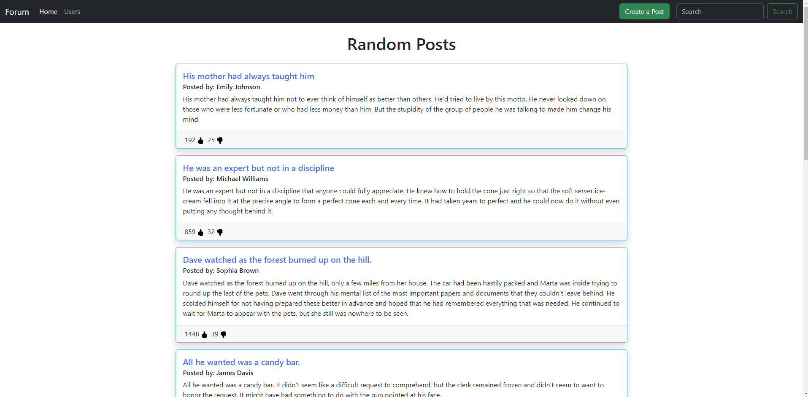

# Forum Webpage

You get to create an amazing post and view other existing posts on this webpage. (Fake generated posts from dummyjson.com)

**Link to project:** https://github.com/hoken92/Post_Forum

## How It's Made:

**Tech used:** HTML, CSS, JavaScript, Restful API, Axios, Bootstrap

1. Within the form webpage, there are multiple fetch and axios requests/responses.
   1. The Home page is pre-populated with responses from the dummyjson API. The response array is then iterated through a for loop and clones an HTML template. The HTML template will have textContent inserted from the response array objects.
      - Users can also paginate on the bottom of the page, to display more posts
   2. Users can create a new post and it will prepend to the top of existing posts.
      - The create post modal also contains empty string validations
   3. Users can like a post and dislike a post
      - De-selecting the like/dislike will decrease the count back to the original count

## Optimizations

1. It would be a great addition to be able to edit random posts, retrieve the response data and populate the response data back into the edited post.
2. Since POST or PUT doesn't actually update to the database, users can't like/dislike new posts. It would be cool to be able like/dislike new posts.

## Lessons Learned:

I learned how to use Fetch API and Axios to request and retrieve API responses. This needed to be used with promises and async/wait functions.

## Contributor:

- Kenneth Ho
